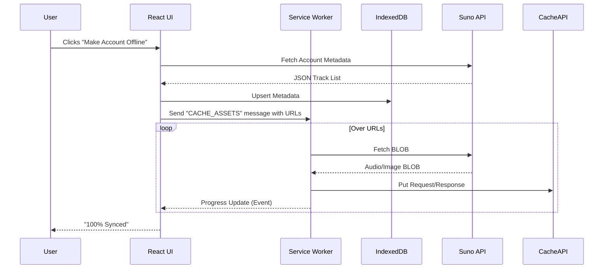
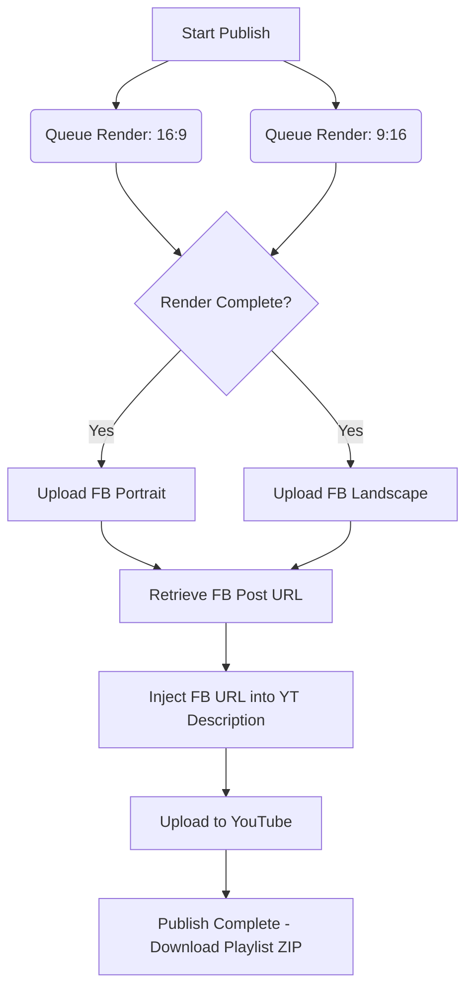

# Suno Architect: System Architecture & Technical Specification

## Deep Analysis (ULTRATHINK)

**Psychological**
Users curating their Suno generated music into albums have an emotional attachment to their creations. The interface must feel sturdy and permanent. Dropping data during offline sync or crashing during a video render shatters trust. Rendering is a high-anxiety waiting period; progress indicators must be granular and deterministic.

**Technical**
The web browser is an increasingly hostile environment for long-running, CPU-intensive tasks like video rendering and file manipulation. 
- *Rendering:* Standard Canvas API with `MediaRecorder` is brittle for exact frame-level composition (like pre/post rolls). WebAssembly (`FFmpeg.wasm`) inside a dedicated Web Worker is mandatory to prevent UI thread blocking and to ensure deterministic compositing of multiple media types (audio, static images for QR/text, background loops).
- *Memory Pressure:* Processing 16:9 and 9:16 videos concurrently will hit the V8 heap limits. Renders must be queued sequentially.
- *Storage:* `localStorage` is completely inadequate (5MB limit, string only). `IndexedDB` (via `idb`) combined with the Service Worker Cache API is required for storing GBs of audio/video BLOBs locally.

**Accessibility**
The Album Builder drag-and-drop interface must be fully keyboard operable. A strict brutalist/utilitarian design system ensures high contrast (WCAG AAA) and predictable focus states. ARIA live regions are critical for announcing rendering progress and offline sync status to screen readers.

**Scalability**
A user's Suno account could contain thousands of tracks. The data layer must support pagination and lazy-loading from IndexedDB. The publishing pipeline must be decoupled—designed as a generic queue that can easily adopt TikTok or Instagram Reels endpoints later without rewriting the core workflow.

**Performance**
Cloudflare Workers have strict CPU time limits (10-50ms). They cannot do the video rendering. Workers will act *only* as secure OAuth proxies and metadata orchestrators. All heavy asset lifting is delegated to the client's local hardware via Web Workers, minimizing server costs to zero.

---

## 1. Album Builder Architecture

### Design Philosophy
**Industrial/Utilitarian.** The interface will reject standard "soft" web paradigms in favor of a rigid, high-contrast, data-dense application feel. Drag-and-drop zones will be clearly defined by solid borders, and typography will be monospace or geometric sans-serif to emphasize the "work" of building an album.

### Data Models
```typescript
interface Track {
  id: string;
  sunoId: string;
  title: string;
  audioUrl: string;
  imageUrl: string;
  metadata: {
    tags: string[];
    prompt: string;
    durationMs: number;
  };
  cachedLocally: boolean;
}

interface Album {
  id: string;
  title: string;
  description: string;
  coverArtUrl: string;
  type: 'EP' | 'LP' | 'Single' | 'GreatestHits';
  trackIds: string[]; // Ordered list referencing Track IDs
  createdAt: number;
  updatedAt: number;
}
```

### UX Flow
1. **Library Pane (Left):** Virtualized list of fetched Suno tracks.
2. **Builder Pane (Right):** Assembly area for the `Album`.
3. **Action:** User drags tracks from Library to Builder. Uses `@dnd-kit/core` for accessibility and robust interaction.

---

## 2. Offline Support Strategy

To enable offline caching of the Suno account, we will implement a dual-layer storage approach to bypass standard browser memory limitations.

### Architecture
- **Metadata Layer (`IndexedDB`):** Structured data (Albums, Tracks, Playlists) managed via the `idb` package. Allows querying and sorting without network access.
- **Asset Layer (`Cache API`):** Audio MP3s/WAVs and image PNGs/JPGs are stored in the browser's Cache Storage via a Service Worker.

### Sync Workflow


---

## 3. Custom Messages & Video Rendering

This requires combining static images, text, and audio into specific aspect ratios entirely within the browser.

### Technical Approach
- **Engine:** `FFmpeg.wasm` running inside a dedicated Web Worker (`offlineRender.worker.ts`).
- **Pre/Post Roll Generation:** Standard HTML5 `<canvas>` is used to draw text ("Tripped Out Tim", QR codes, "Thank You"). The canvas is exported as a static image Blob.
- **Compositing:** FFmpeg commands are used to concatenate the assets. 
  - *Example:* `ffmpeg -loop 1 -i preroll.jpg -t 5 -i main.mp4 -loop 1 -i postroll.jpg -t 5 -filter_complex "[0:v][1:v][2:v]concat=n=3:v=1:a=0[outv]" -map "[outv]" final.mp4`

### Aspect Ratio Handling
We will use FFmpeg filters to handle framing:
- **YouTube (Landscape 16:9):** Scale video to fit inside 1920x1080, pad the rest with a blurred version of the cover art.
- **Facebook (Portrait 9:16):** Scale video to fit 1080x1920, pad top/bottom with solid black or blurred background.

---

## 4. Publishing & Deployment Workflows

To achieve simultaneous publishing and cross-referencing, the system must handle a staged asynchronous pipeline.

### Integration Points
- **YouTube API (v3):** OAuth via Cloudflare Worker. Handles `video.insert`.
- **Facebook Graph API:** OAuth via Cloudflare Worker. Handles `page/videos` edge.

### The Pipeline


### Downloading Playlists
- Once an album is finalized, the client utilizes `JSZip` to bundle all cached MP3s and metadata from `IndexedDB` / `Cache API` into a single `.zip` file, completely bypassing the need to re-download from Suno.